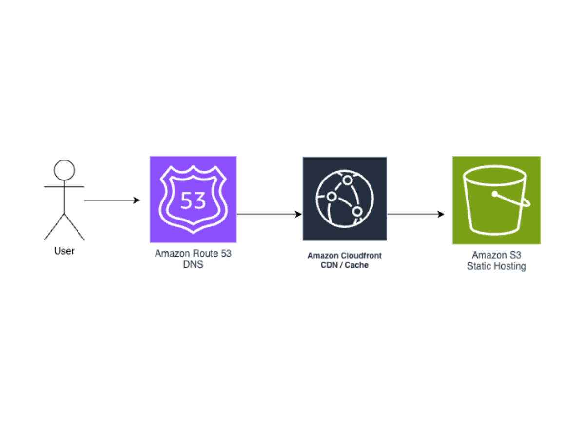

# S3 + CloudFront 静的サイトホスティング

## 概要
Amazon S3 と CloudFront を使用した静的ウェブサイトのホスティング構成です。

## アーキテクチャ

## 使用サービス
- Amazon S3（静的ファイルの保存）
- Amazon CloudFront（CDN・HTTPS対応）
- Amazon Route 53（独自ドメイン設定）

## 構成のポイント
- S3バケットへの直接アクセスを禁止し、CloudFront経由のみ許可
- HTTPS対応済み
- CloudFrontのキャッシュ設定によりパフォーマンス最適化

## 目的
静的サイトを高速かつ安全に公開するため

## 課題
- S3を直接公開するとセキュリティリスクがある
- アクセス増加時のパフォーマンス低下
- HTTPS未対応による信頼性の低下

## 解決
- CloudFrontを利用しCDN配信を実装
- S3への直接アクセスを制限（CloudFront経由のみ許可）
- HTTPS対応（ACM + CloudFront）
- キャッシュ設定により高速表示を実現

## 結果
- 高速かつ安全なWebサイト公開を実現
- キャッシュによりレスポンス速度向上
- HTTPS対応により信頼性を確保

## 工夫した点
- CloudFrontのキャッシュ制御を調整し表示速度を最適化
- 独自ドメイン設定によりブランディング強化
- S3への直接アクセス制御でセキュリティ向上

## 実装したサイト
https://swell-webworks.com
